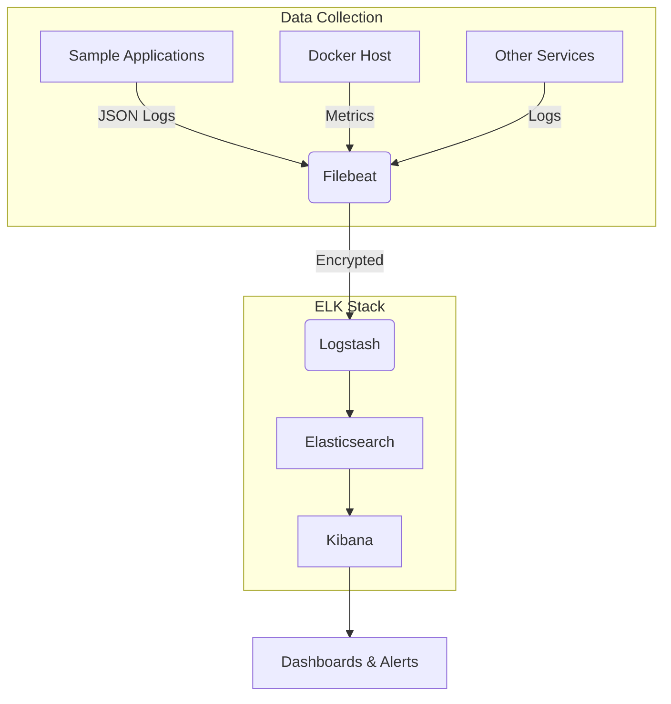

# Centralized Logging & Monitoring with ELK Stack

A production-ready centralized logging and monitoring system using the ELK (Elasticsearch, Logstash, Kibana) Stack with Filebeat for collecting, parsing, enriching, storing, and visualizing application logs with real-time monitoring dashboards.

## Architecture Overview



## Features

- ✅ **3-Node Elasticsearch Cluster**: High availability and resilience with dedicated master nodes
- ✅ **Log Processing Pipeline**: Modular Logstash pipeline with JSON parsing, Grok patterns, and GeoIP enrichment
- ✅ **Docker Autodiscovery**: Filebeat automatically discovers and collects logs from all containers
- ✅ **Real-time Dashboards**: Pre-configured Kibana dashboards for performance monitoring, error tracking, and system health
- ✅ **Security**: TLS/SSL encryption, role-based access control, and secure credential management
- ✅ **Index Lifecycle Management**: Hot-warm-cold architecture with automated log retention and deletion policies
- ✅ **High Availability**: Production-ready configuration with proper resource allocation and health checks
- ✅ **Distributed Tracing**: Correlation ID support for tracking requests across microservices

## Project Structure

```
elk-logging-project/
├── docker-compose.yml
├── elasticsearch/
│   ├── config/
│   │   └── elasticsearch.yml
│   └── Dockerfile
├── logstash/
│   ├── config/
│   │   └── logstash.yml
│   ├── pipeline/
│   │   └── logstash.conf
│   └── Dockerfile
├── kibana/
│   ├── config/
│   │   └── kibana.yml
│   └── Dockerfile
├── filebeat/
│   ├── config/
│   │   └── filebeat.yml
│   └── Dockerfile
├── sample-apps/
│   ├── app1/           # Node.js sample application
│   └── app2/           # Python sample application
├── dashboards/
│   └── export/         # Exported Kibana dashboard configurations
├── scripts/
│   ├── setup.sh        # Environment setup script
│   ├── health-check.sh # Component health verification
│   └── index-lifecycle-management.sh # ILM policy configuration
├── .env                # Environment variables
└── README.md
```

## Prerequisites

- Docker Engine 20.10+
- Docker Compose v2.15+
- OpenSSL (for certificate generation)
- curl (for API calls)
- jq (for JSON processing)

## Setup Instructions

### 1. Clone the Repository

```bash
git clone https://github.com/yourusername/elk-logging-project.git
cd elk-logging-project
```

### 2. Initialize the Environment

Run the setup script to generate SSL certificates, create directories, and prepare the environment:

```bash
./scripts/setup.sh
```

This script will:
- Create required directory structure
- Generate SSL certificates for secure communication
- Set up environment variables
- Make scripts executable
- Create ILM policy templates

### 3. Configure Environment Variables

Copy the example environment file and customize it for your deployment:

```bash
cp .env.example .env
```

Edit the `.env` file to set appropriate values for your environment:

```env
# ELK Stack Configuration
ELASTICSEARCH_VERSION=8.11.3
LOGSTASH_VERSION=8.11.3
KIBANA_VERSION=8.11.3
FILEBEAT_VERSION=8.11.3

# Security Settings
ELASTICSEARCH_USERNAME=elastic
ELASTICSEARCH_PASSWORD=your_strong_password_here
KIBANA_ENCRYPTION_KEY=your_encryption_key_here
SSL_KEY_PASSPHRASE=your_ssl_passphrase_here

# Resource Allocation
ES_HEAP_SIZE=4g
ES_JAVA_OPTS=-Xms4g -Xmx4g

# Network Configuration
ELASTICSEARCH_HOSTS=["https://elasticsearch:9200"]
CERTIFICATE_AUTHORITIES=/usr/share/elasticsearch/config/certs
```

### 4. Start the ELK Stack

Bring up all services using Docker Compose:

```bash
docker-compose up -d
```

### 5. Set Up Index Lifecycle Management

Configure ILM policies for log retention and management:

```bash
./scripts/index-lifecycle-management.sh
```

### 6. Verify Installation

Check the health of all components:

```bash
./scripts/health-check.sh
```

## Usage Guide

### Accessing Kibana

Once the stack is running, access Kibana web interface at:

```
http://localhost:5601
```

Log in with the credentials configured in your `.env` file.

### Creating Index Patterns

1. Navigate to **Stack Management** > **Index Patterns**
2. Click **Create index pattern**
3. Enter `logs-*` as the index pattern
4. Select `@timestamp` as the timestamp field
5. Click **Create**

### Importing Dashboards

1. Navigate to **Stack Management** > **Saved Objects**
2. Click **Import**
3. Select one of the JSON files from `dashboards/export/` directory
4. Check **Overwrite all objects** if you want to replace existing dashboards
5. Click **Import**

Available dashboards:
- `app-performance-dashboard.json`: Application Performance Monitoring
- `error-tracking-dashboard.json`: Error Rate Tracking
- `system-health-dashboard.json`: System Health Metrics
- `realtime-log-stream-dashboard.json`: Real-time Log Stream
- `security-monitoring-dashboard.json`: Security Monitoring

### Viewing Logs

1. Navigate to **Discover**
2. Select the `logs-*` index pattern
3. Use the time picker to select your desired time range
4. Use the search bar to filter logs by:
   - Service name: `service_name:"app1"`
   - Log level: `level:"ERROR"`
   - Correlation ID: `correlation_id:"abc123"`
   - Custom fields: `json_data.responseTime:>100`

## Sample Applications

Two sample applications are included to demonstrate log generation:

### App 1 (Node.js)
- Runs on port 3000
- Generates structured JSON logs
- Simulates various scenarios:
  - `/api/data`: Normal operation with response time tracking
  - `/api/warning`: Warning scenario (deprecated endpoint)
  - `/api/error`: Error scenario (internal server error)
  - `/health`: Health check endpoint

### App 2 (Python)
- Runs on port 5000
- Generates structured JSON logs
- Simulates various scenarios:
  - `/api/data`: Normal operation
  - `/api/warning`: Warning scenario
  - `/api/error`: Validation error (400)
  - `/api/critical`: Critical error (500)
  - `/health`: Health check endpoint

## Monitoring & Alerting

### Built-in Dashboards

#### Application Performance Monitoring
- Response time trends
- Requests per minute
- Error rate gauges
- Top slowest endpoints

#### Error Tracking
- Error count by severity level
- Top error messages
- Error distribution by service
- Error trends over time

#### System Health
- CPU usage by container
- Memory consumption
- Disk I/O operations
- Network traffic

### Setting Up Alerts

1. Navigate to **Alerts and Insights** > **Rules**
2. Click **Create rule**
3. Choose a rule type (e.g., "Threshold")
4. Configure the alert conditions:
   - **Name**: "High Error Rate"
   - **Index pattern**: `logs-*`
   - **Condition**: `level: "ERROR"` with count > 10 in last 5 minutes
   - **Action**: Send email or webhook notification
5. Save the rule

Example alert configurations available in `dashboards/export/`.

## Security Best Practices

### Authentication & Authorization
- Enabled Elasticsearch security features
- Configured Kibana authentication
- Implemented role-based access control (RBAC)
- Used environment variables for sensitive credentials

### Encryption
- TLS/SSL enabled for all communications
- Certificate Authority (CA) generated for internal services
- Mutual TLS authentication between components
- Secure credential storage in `.env` file

### Network Security
- Docker networks for service isolation
- Restricted external access to management interfaces
- Firewall rules to limit access to Kibana and Elasticsearch APIs

## Performance Tuning

### Elasticsearch
- Heap size set to 50% of available RAM (max 32GB)
- Proper sharding strategy (1-2 shards per node)
- Index lifecycle management for log retention
- Dedicated master nodes for production readiness

### Logstash
- Pipeline batch size optimized for throughput
- Worker threads configured based on CPU cores
- Persistent queues for reliability
- Monitoring enabled for performance insights

### Filebeat
- Multiline pattern matching for stack traces
- Backpressure handling for reliability
- Log filtering to reduce unnecessary data ingestion
- Efficient resource usage with minimal overhead

## Maintenance Scripts

### Health Check
Monitor the status of all ELK components:

```bash
./scripts/health-check.sh
```

### Backup & Restore
Implement snapshot and restore for backup operations:

```bash
# Create snapshot repository
curl -X PUT "localhost:9200/_snapshot/my_backup" -H 'Content-Type: application/json' -d'
{
  "type": "fs",
  "settings": {
    "location": "/snapshots",
    "compress": true
  }
}'

# Create snapshot
curl -X PUT "localhost:9200/_snapshot/my_backup/snapshot_1?wait_for_completion=true"
```

### Index Lifecycle Management
Manage log retention policies:

```bash
./scripts/index-lifecycle-management.sh
```

## Troubleshooting

### Common Issues

#### 1. Elasticsearch Not Starting
Check logs:
```bash
docker logs elasticsearch
```

Common causes:
- Insufficient memory (increase heap size)
- Permission issues (ensure data directory is writable)
- Port conflicts (check if port 9200 is already in use)

#### 2. Logstash Pipeline Errors
Check Logstash logs:
```bash
docker logs logstash
```

Common causes:
- Invalid Grok patterns
- Missing plugins
- Configuration syntax errors

#### 3. Filebeat Connection Issues
Check Filebeat logs:
```bash
docker logs filebeat
```

Common causes:
- Incorrect Logstash host/port
- SSL certificate validation failures
- Docker socket permissions

#### 4. Kibana Cannot Connect to Elasticsearch
Check Kibana logs:
```bash
docker logs kibana
```

Common causes:
- Incorrect Elasticsearch URL
- Authentication failures
- Network connectivity issues

### Diagnostic Commands

```bash
# Check cluster health
curl -u elastic:password http://localhost:9200/_cluster/health?pretty

# List indices
curl -u elastic:password http://localhost:9200/_cat/indices?v

# Check node information
curl -u elastic:password http://localhost:9200/_cat/nodes?v

# Test Logstash pipeline
curl -X GET http://localhost:9600
```

## Publishing to GitHub

If you're using the GitHub Desktop application and see the message "This directory does not appear to be a Git repository. Would you like to create a repository here instead?" you have two options:

- **Create a repository here (recommended for local-first workflows):** Click "Create a repository here" in the GitHub Desktop dialog. This will initialize a local git repository. After that, use the "Publish repository" button to push it to GitHub.
- **Connect to an existing repository:** If you'd rather connect to an existing GitHub repo, create the repository on GitHub (or via the `gh` CLI), then add the remote and push. You can do this from PowerShell using the commands below.

PowerShell commands to initialize and push the repository (for manual setup or to use with GitHub Desktop):

```powershell
cd "c:\Users\jourd\Desktop\DevOps Projects\Centralized Logging Monitoring with ELK Stack\elk-logging-project"
git init
git add .
git commit -m "Initial commit: Centralized logging & monitoring with ELK Stack"

# If you want to create and push a remote repo using GitHub CLI (gh), run:
gh repo create your-github-username/elk-logging-project --public --source . --remote origin --push

# OR add a remote and push manually if you created the repo through github.com:
git remote add origin https://github.com/your-github-username/elk-logging-project.git
git branch -M main
git push -u origin main
```

I included a convenience script in `scripts/publish-to-github.ps1` which can initialize the repo, make an initial commit, and optionally create the remote via `gh`.

Note: Make sure `.env` and similar sensitive files are in `.gitignore` so you don't accidentally commit credentials. The repository already includes a `.gitignore` with typical exclusions.


## Testing Requirements

### Test Data Generation
The setup script creates sample log data in `sample-data/sample-logs.json`. You can also use the sample applications to generate live test data.

### Example Queries
Use these example queries in Kibana Discover:

```kql
# All errors in the last hour
level: "ERROR"

# Slow requests (>100ms)
json_data.responseTime:>100

# Errors by service
level: "ERROR" and service_name:"app1"

# Correlation ID tracking
correlation_id:"abc123"
```

### Stress Testing
Simulate high load on sample applications:

```bash
# Install Apache Bench
sudo apt-get install apache2-utils

# Test App 1 with 100 concurrent requests
ab -n 1000 -c 100 http://localhost:3000/api/data

# Test App 2 with 50 concurrent requests
ab -n 500 -c 50 http://localhost:5000/api/data
```

## Additional Resources

- [Elasticsearch Documentation](https://www.elastic.co/guide/en/elasticsearch/reference/current/index.html)
- [Logstash Documentation](https://www.elastic.co/guide/en/logstash/current/index.html)
- [Kibana Documentation](https://www.elastic.co/guide/en/kibana/current/index.html)
- [Filebeat Documentation](https://www.elastic.co/guide/en/beats/filebeat/current/index.html)
- [Docker Compose Reference](https://docs.docker.com/compose/compose-file/)

## License

MIT License

Copyright (c) 2025 Your Name

Permission is hereby granted, free of charge, to any person obtaining a copy
of this software and associated documentation files (the "Software"), to deal
in the Software without restriction, including without limitation the rights
to use, copy, modify, merge, publish, distribute, sublicense, and/or sell
copies of the Software, and to permit persons to whom the Software is
furnished to do so, subject to the following conditions:

The above copyright notice and this permission notice shall be included in all
copies or substantial portions of the Software.

THE SOFTWARE IS PROVIDED "AS IS", WITHOUT WARRANTY OF ANY KIND, EXPRESS OR
IMPLIED, INCLUDING BUT NOT LIMITED TO THE WARRANTIES OF MERCHANTABILITY,
FITNESS FOR A PARTICULAR PURPOSE AND NONINFRINGEMENT. IN NO EVENT SHALL THE
AUTHORS OR COPYRIGHT HOLDERS BE LIABLE FOR ANY CLAIM, DAMAGES OR OTHER
LIABILITY, WHETHER IN AN ACTION OF CONTRACT, TORT OR OTHERWISE, ARISING FROM,
OUT OF OR IN CONNECTION WITH THE SOFTWARE OR THE USE OR OTHER DEALINGS IN THE
SOFTWARE.
